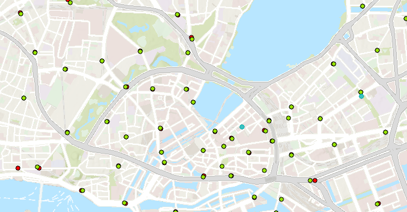

# priobike-map-data - Download & Generierung von zusätzlichen Karteninformationen im Umkreis Hamburg

- _Autor_: Markus Wieland
- _E-Mail_: markus.wieland@mailbox.tu-dresden.de

Mit diesem Repo werden zusätzliche Karteninformationen für die PrioBike-App heruntergeladen und aufbereitet. Alle durch diese Skripte erzeugten Geodaten sind in dem Koordinatensystem `EPSG:4326` gespeichert.

## Skripte

### `export_osm_data.py`

Dieses Skript lädt die neusten OpenStreetMap Daten der Stadt Hamburg (angeboten durch [Geofabrik](http://download.geofabrik.de/europe/germany/hamburg-latest-free.shp.zip)) herunter. Diese werden anschließend anhand der Werte des Attributes `fclass` gefiltert und anschließend in einer `geojson`-Datei gespeichert. In diesen Datensätzen werden manche Features als Punktdaten und andere als Polygone gespeichert. Die Datensätze enthalten jedoch unterschiedliche Features.

- Fahrradständer (Punktdaten): `gis_osm_traffic_free_1.shp` → `bicycle_parking.geojson` (`fclass=parking_bicycle`)
- Fahrradständer (Polygondaten): `gis_osm_traffic_a_free_1.shp` → `bicycle_parking_polygon.geojson` (`fclass=parking_bicycle`)
- Fahrradleihstationen (Punktdaten): `gis_osm_pois_free_1` → `bicycle_rental` (`fclass=bicycle_rental`)
- Fahrradleihstationen (Polygondaten): `gis_osm_pois_a_free_1` → `bicycle_rental` (`fclass=bicycle_rental_polygon`)
- Fahrradläden/Werkstätten (Punktdaten): `gis_osm_pois_free_1` → `bicycle_shop` (`fclass=bicycle_shop`)
- Fahrradläden/Werkstätten (Polygondaten): `gis_osm_pois_a_free_1` → `bicycle_shop` (`fclass=bicycle_shop_polygon`)

### `export_wfs_data.py`

Dieses Skript lädt Daten aus verschiedenen Web Feature Services ([WFS](https://en.wikipedia.org/wiki/Web_Feature_Service)) der Stadt Hamburg herunter und speichert diese in einer `geojson`-Datei. Folgende WFS werden verwendet:

#### 1. HH_WFS_Bike_und_Ride (`data/generated/wfs/bike_and_ride.geojson`)

Der Datensatz enthält die Lage der Fahrradabstellanlagen an Schnellbahnhaltestellen im Hamburger Stadtgebiet. Für jede Abstellanlage wird die Anzahl der öffentlichen Stellplätze (überdacht und nicht überdacht) und, wenn vorhanden, die Anzahl der abschließbaren Mietplätze angegeben. Mehr Details siehe [hier](https://metaver.de/trefferanzeige?docuuid=337AA4A2-72EF-4AE0-A8F6-D35B243532DC). [Lizenz](https://www.govdata.de/dl-de/by-2-0). [Quelle](`https://geodienste.hamburg.de/HH_WFS_Bike_und_Ride?SERVICE=WFS&REQUEST=GetFeature&outputFormat=application/geo%2Bjson&version=2.0.0&typeName=de.hh.up:bike_und_ride&srsname=EPSG:4326`).

#### 2. HH_WFS_Verkehrslage (`data/generated/wfs/traffic.geojson`)

Der Datensatz enthält die Verkehrslage in Echtzeit (Aktualisierung alle 5 Minuten) auf dem Hamburger Straßennetz und auf größeren Straßen im direkten Hamburger Umland sowie auf den durch Hamburg verlaufenden Autobahnen südlich bis Lüneburg, Hannover und Bremen und nördlich bis Itzehoe, Flensburg und Lübeck.

Die Verkehrslage ist in 4 Zustandsklassen eingeteilt, von Zustandsklasse 1, fließender Verkehr (grün) über Zustandsklasse 2, dichter Verkehr (orange) und Zustandsklasse 3, zäher Verkehr (rot) bis Zustandsklasse 4, gestauter Verkehr (dunkelrot).
Liegen für einzelne Segmente dauerhaft oder zeitweise keine Daten vor, wird keine Verkehrslage angezeigt. Mehr Details siehe [hier](https://metaver.de/trefferanzeige?docuuid=22E00411-7932-47A6-B2DA-26F6E3E22B5E). [Lizenz](https://www.govdata.de/dl-de/by-2-0). [Quelle](`https://geodienste.hamburg.de/HH_WFS_Verkehrslage?SERVICE=WFS&REQUEST=GetFeature&typeName=de.hh.up:verkehrslage&version=2.0.0&OUTPUTFORMAT=application/geo%2Bjson&srsname=EPSG:4326`).

#### 3. HH_WFS_Baustellen (`data/generated/wfs/construction_sites.geojson`)

Baustellen auf Hauptverkehrs- und Bundesfernstraßen Hamburg. Mehr Details siehe [hier](https://www.govdata.de/suchen/-/details/baustellen-auf-hauptverkehrs-und-bundesfernstrassen-hamburg). [Lizenz](https://www.govdata.de/dl-de/by-2-0). [Quelle](`https://geodienste.hamburg.de/HH_WFS_Baustellen?SERVICE=WFS&REQUEST=GetFeature&typeName=de.hh.up:tns_steckbrief_visualisierung&version=2.0.0&OUTPUTFORMAT=application/geo%2Bjson&srsname=EPSG:4326`).

#### 4. HH_WFS_Stadtrad (`data/generated/wfs/stadt_rad.geojson`)

Der Datensatz enthält die Position aller StadtRAD-Stationen im Hamburger Stadtgebiet und die Anzahl der aktuell zur Ausleihe zur Verfügung stehenden Fahrräder und Lastenpedelecs. Mehr Details siehe [hier](https://metaver.de/trefferanzeige?docuuid=D18F375E-FA5F-4998-AFF8-557969F44479). [Lizenz](https://www.govdata.de/dl-de/by-2-0). [Quelle](`https://geodienste.hamburg.de/HH_WFS_Stadtrad?SERVICE=WFS&VERSION=2.0.0&REQUEST=GetFeature&typename=de.hh.up:stadtrad_stationen&outputFormat=application/geo%2bjson&srsname=EPSG:4326`).

#### 5. HH_WFS_Fahrradluftstationen (`data/generated/wfs/bike_air_station.geojson`)

[Lizenz](https://www.govdata.de/dl-de/by-2-0). [Quelle](`https://geodienste.hamburg.de/HH_WFS_Fahrradluftstationen?SERVICE=WFS&VERSION=1.1.0&REQUEST=GetFeature&typename=de.hh.up:fahrradluftstationen&OUTPUTFORMAT=application/geo%2Bjson&srsname=EPSG:4326`).

#### 6. HH_WFS_ITS_Dienste_Hamburg (`data/generated/wfs/static_green_waves.geojson`)

Statische grüne Wellen in Hamburg. Mehr Details siehe [hier](https://metaver.de/trefferanzeige?cmd=doShowDocument&docuuid=A1ADDD06-FAF3-42B7-8C32-E430EAD67E9F&plugid=/ingrid-group:ige-iplug-hmdk.metaver). [Lizenz](https://www.govdata.de/dl-de/by-2-0). [Quelle](`https://geodienste.hamburg.de/HH_WFS_ITS_Dienste_Hamburg?SERVICE=WFS&VERSION=1.1.0&REQUEST=GetFeature&typeName=de.hh.up:its_iot_registry&OUTPUTFORMAT=application/geo%2Bjson&srsname=EPSG:4326&Filter=%3Cogc:Filter%20xmlns:ogc=%22http://www.opengis.net/ogc%22%3E%3Cogc:PropertyIsEqualTo%3E%3Cogc:PropertyName%3Epurpose_id%3C/ogc:PropertyName%3E%3Cogc:Literal%3E14%3C/ogc:Literal%3E%3C/ogc:PropertyIsEqualTo%3E%3C/ogc:Filter%3E`).

#### 7. HH_WFS_ITS_Dienste_Hamburg (`data/generated/wfs/prio_change.geojson`)

Mehr Details siehe [hier](https://metaver.de/trefferanzeige?cmd=doShowDocument&docuuid=A1ADDD06-FAF3-42B7-8C32-E430EAD67E9F&plugid=/ingrid-group:ige-iplug-hmdk.metaver). [Lizenz](https://www.govdata.de/dl-de/by-2-0). [Quelle](`https://geodienste.hamburg.de/HH_WFS_ITS_Dienste_Hamburg?SERVICE=WFS&VERSION=1.1.0&REQUEST=GetFeature&typeName=de.hh.up:its_iot_registry&OUTPUTFORMAT=application/geo%2Bjson&srsname=EPSG:4326&Filter=%3Cogc:Filter%20xmlns:ogc=%22http://www.opengis.net/ogc%22%3E%3Cogc:PropertyIsEqualTo%3E%3Cogc:PropertyName%3Epurpose_id%3C/ogc:PropertyName%3E%3Cogc:Literal%3E15%3C/ogc:Literal%3E%3C/ogc:PropertyIsEqualTo%3E%3C/ogc:Filter%3E`).

#### 8. HH_WFS_Velorouten (`data/generated/wfs/velo_routes.geojson`)

Der Datensatz enthält das Netz der 14 Velorouten für den Alltagsradverkehr (ca. 280 km) in Hamburg. Die Velorouten verbinden die City mit wichtigen Alltagszielen wie den Wohngebieten der inneren und äußeren Stadt, Stadtteilzentren und Arbeitsplatzschwerpunkten. Mehr Details siehe [hier](https://metaver.de/trefferanzeige?docuuid=8254E244-7DD3-401D-AA15-4CDE78D4E91F).
[Lizenz](https://www.govdata.de/dl-de/by-2-0). [Quelle](`"https://geodienste.hamburg.de/HH_WFS_Velorouten?SERVICE=WFS&VERSION=1.1.0&REQUEST=GetFeature&OUTPUTFORMAT=application/geo%2Bjson&srsname=EPSG:4326&typename=de.hh.up:velorouten"`).

### `merge_bicycle_rental.py`

**Anmerkung**: Benötigt die OSM und WFS, welche von `export_osm_data.py` und `export_wfs_data.py` heruntergeladen werden. Die Download-Skripte sollten vor der Ausführung dieses Skripts ausgeführt werden.

Die OSM-Daten zu Fahrradleihstation (`data/generated/osm/bicycle_rental.geojson`) enthält fast alle Fahrradleihstationen aus dem StadtRAD-Datensatz der Stadt Hamburg (`data/generated/wfs/stadt_rad.geojson`) + einige weitere.

Damit die Stationen nicht doppelt angezeigt werden, versucht das Skript diese beiden Dateien zu vereinigen. Das geschieht über das `name`-Attribute, welches sowohl in den OSM-Daten als auch in den WFS-Daten vorkommt. Durch die "Natur" von OSM sind jedoch nicht alle Namen perfekt übereinstimmend (fehlende Leerzeichen, "U-Bahn" statt "U", Tippfehler etc.). Im September 2023 können 272 von 306 StadtRAD-Stationen perfekt gematched werden. Die restlichen ~10% werden versucht per Levenshtein-Distanz und anschließend per örtlicher Nähe zu mappen. Übrig bleiben 6 Stationen, welche keinen OSM-Eintrag besitzen. Das liegt vermutlich an der Aktualität der OSM-Daten. Diese verbleibenden Daten werden dem OSM-Datensatz hinzugefügt. Zum Schluss wird der vereinigte Datensatz in `data/generated/osm/bicycle_rental.geojson` gespeichert.

### `generate_accident_hot_spots.py`

**Anmerkung**: Benötigt die Unfalldaten, welche von `download_accidents.py` heruntergeladen werden. Außerdem werden die OSM-Daten der Geofabrik benötigt, welche in `export_osm_data.py` heruntergeladen werden (die `.shp` Dateien, nicht die erzeugten GeoJSONs). Die Download-Skripte sollten vor der Ausführung dieses Skripts ausgeführt werden.

In diesem Skript werden die heruntergeladenen Unfalldaten aus dem [Unfallatlas des Statisportal](https://unfallatlas.statistikportal.de/) ([Lizenz](https://www.govdata.de/dl-de/by-2-0)) genutzt um Unfallschwerpunkte in der Stadt Hamburg ausfindig zu machen. Dafür werden zusätzlich die Straßen-Daten von OpenStreetMap und ein Umrandungspolygon der Stadt Hamburg benötigt ([Quelle](http://opendatalab.de/projects/geojson-utilities/)). Die Unfälle werden geclustert und anschließend bewertet. (Dichte der Unfälle, Straßenart (Schnellstraße → mehr Autos), Anzahl der Unfälle, Schwere der Unfälle). Am Ende werden die `30` Unfallschwerpunkte mit dem höchsten Score in `data/generated/accidents/accident_hotspots.geojson` gespeichert. Wenn man diese Zahl anpassen möchte, kann man die Anzahl der Schwerpunkte dem Skript übergeben. Beispiel: `python generate_accident_hot_spots.py 20`.
